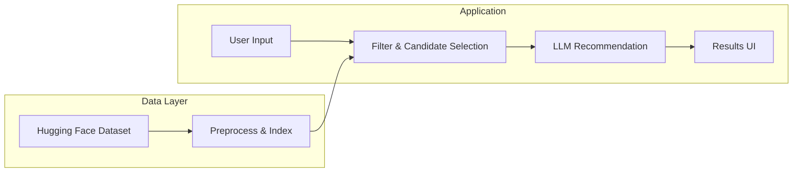
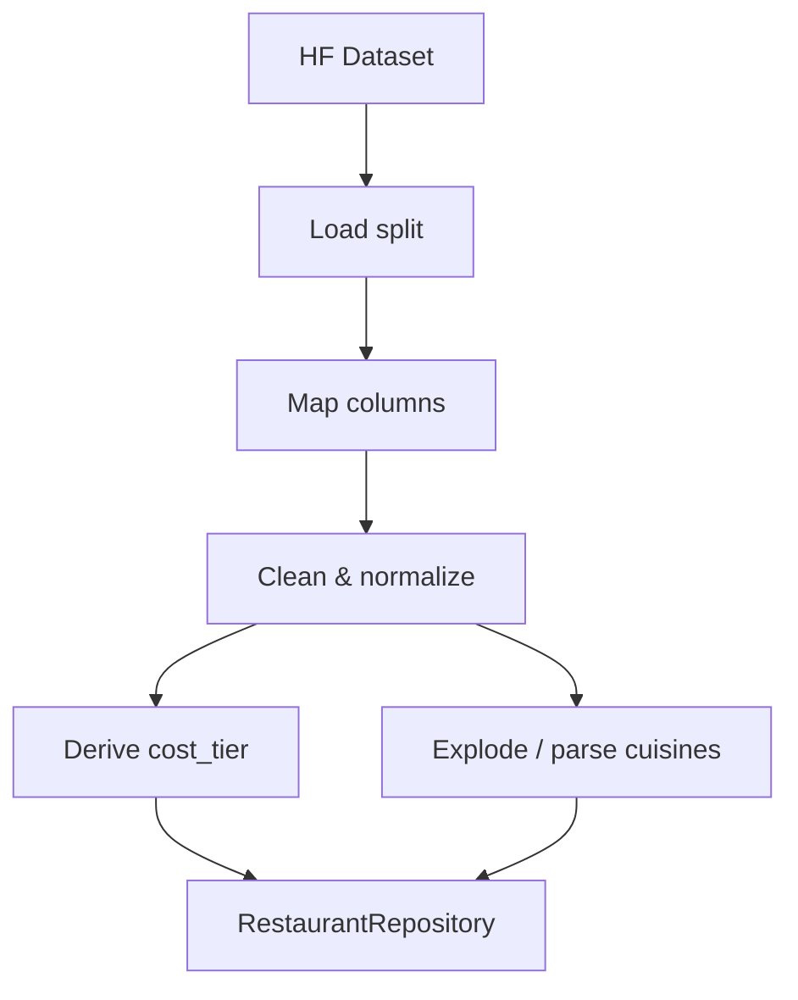
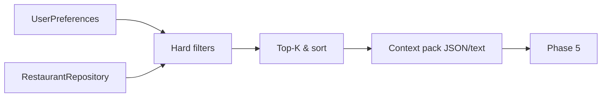
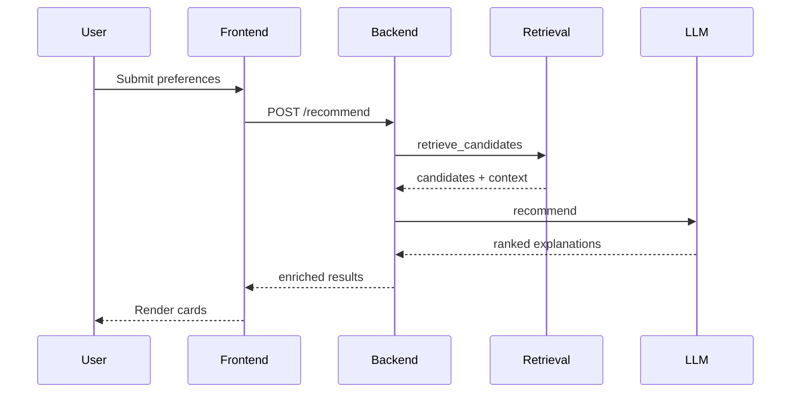
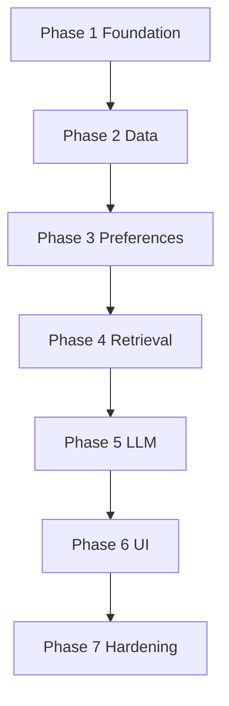

# Phase-Wise Architecture: AI-Powered Restaurant Recommendation System

This document expands the [problem statement](./problemstatement.md) into a buildable, phase-wise architecture. Each phase has clear objectives, components, interfaces, data flows, and deliverables.

---

## Executive Summary

The system combines **structured restaurant data** (Zomato-style dataset from Hugging Face) with an **LLM** to produce **ranked, explained** recommendations from **user preferences** (locality, budget, cuisine, rating, free-text constraints).

**High-level flow:**



---

## Phase 1 — Foundation & Project Skeleton

### Objectives

- Establish repository layout, dependency management, and configuration so later phases plug in without rework.
- Define coding standards, environment variables, and secrets handling for API keys (LLM provider).

### Components

| Component | Responsibility |
|-----------|----------------|
| **Repo root** | `README`, license, `.gitignore`, optional `docker-compose` stub |
| **Config module** | Load env vars: `LLM_API_KEY`, `LLM_MODEL`, `DATA_CACHE_DIR`, log level |
| **Package layout** | Clear boundaries: `data/`, `services/`, `api/` or `app/`, `prompts/` |

### Suggested directory structure (evolvable)

```
PROJ/
├── src/
│   ├── config/           # settings from env
│   ├── data/             # ingestion, schemas, preprocessing
│   ├── retrieval/        # filtering, candidate selection
│   ├── llm/              # client, prompts, parsers
│   └── app/              # CLI or web entrypoints
├── tests/
├── prompts/              # versioned prompt templates (optional)
├── problemstatement.md
└── architecture.md
```

### Interfaces (contracts to honor later)

- **Settings object**: immutable after load; no scattered `os.getenv` in business logic.
- **Logging**: structured logs for pipeline steps (load, filter count, LLM latency).

### Deliverables

- Runnable empty app (e.g. `python -m src.app` or `npm start` depending on stack).
- Documented env vars in README snippet.
- Basic CI hook optional: lint + unit test job.

### Dependencies

- None (first phase).

### Risks / notes

- Choose stack early (Python is natural for `datasets` + LLM SDKs); document if you use Node/TS instead.

---

## Phase 2 — Data Ingestion & Preprocessing

### Objectives

- Load the [ManikaSaini/zomato-restaurant-recommendation](https://huggingface.co/datasets/ManikaSaini/zomato-restaurant-recommendation) dataset reliably.
- Normalize fields into a **canonical schema** aligned with the problem statement: name, location, cuisine, cost, rating, and any useful extras (e.g. votes, establishment type).
- Support **local caching** and **deterministic preprocessing** for reproducible demos and tests.

### Components

| Component | Responsibility |
|-----------|----------------|
| **Loader** | `datasets.load_dataset(...)` with revision pin; handle splits |
| **Schema mapper** | Map raw column names → internal names (`restaurant_name`, `city`/`location`, `cuisines`, `average_cost_for_two` or equivalent, `aggregate_rating`, etc.) |
| **Cleaner** | Handle nulls, type coercion, cuisine string splitting (e.g. comma-separated), rating bounds |
| **Store abstraction** | In-memory DataFrame/table for MVP; optional SQLite/Parquet for larger runs |
| **Sample / subset** | Configurable row limit for fast iteration |

### Canonical internal schema (illustrative)

Fields should match whatever the dataset actually provides after inspection; treat this as the **target shape** for downstream code:

- `id` (stable hash or row index)
- `name`
- `location` (city or area — align with user input vocabulary)
- `cuisines` (list of strings)
- `cost_tier` or numeric `cost_for_two` (derive `low` / `medium` / `high` buckets with documented thresholds)
- `rating` (float, 0–5 or as per dataset)
- `raw` (optional JSON blob for extra columns passed to LLM context)

### Data flow



### Interfaces

- **`RestaurantRepository`**: `get_all() -> list[Restaurant]` or `query(predicate) -> Iterator[Restaurant]`
- **`load_restaurants(config) -> RestaurantRepository`**: single entry for tests to mock

### Deliverables

- Unit tests on cleaning (null handling, cuisine parsing, tier mapping).
- Small fixture JSON/CSV for tests without hitting the network every time.

### Dependencies

- Phase 1 (config for cache path, sample size).

### Risks / notes

- **Schema drift**: HF dataset columns may differ; Phase 2 should include a one-time **schema audit script** that prints columns and sample rows.
- **Location granularity**: user may say “Delhi” while data uses neighborhoods — document matching strategy (fuzzy, substring, or normalized city field only).

---

## Phase 3 — User Preferences & Validation

> **Note**: This phase will use the **Groq** LLM. The required API key should be stored in a `.env` file and loaded via the configuration module.


### Objectives

- Define a **strict preference model** (types, allowed values, defaults).
- Validate and normalize input from UI/API/CLI before retrieval and LLM calls.

### Components

| Component | Responsibility |
|-----------|----------------|
| **Preference model** | Pydantic/dataclass/JSON Schema: `location`, `budget`, `cuisine`, `min_rating`, `extras` (free text or tags) |
| **Normalizer** | Trim strings, map synonyms (“cheap” → low budget), default `min_rating` |
| **Validator** | Reject impossible combos early with clear errors |

### Preference schema (logical)

- `locality: str` — required for MVP and chosen from available dataset localities
- `budget: Enum[low, medium, high]` — maps to cost rules from Phase 2
- `cuisine: str | list[str]` — match any of listed cuisines
- `min_rating: float` — inclusive lower bound
- `extras: str | None` — e.g. “family-friendly, quick service” for LLM only or for keyword pre-filter

### Interfaces

- **`parse_preferences(raw: dict) -> UserPreferences`**
- **`UserPreferences.to_filter_spec() -> FilterSpec`** — pure data for retrieval layer

### Deliverables

- Validation tests (missing locality, bad budget token, rating out of range).
- Locality listing endpoint (e.g. `GET /localities`) so UI can render a strict locality selector.
- OpenAPI or typed boundary if using HTTP API.

### Dependencies

- Phase 2 (cost tier definitions must align with `FilterSpec`).

### Risks / notes

- **Ambiguous cuisine**: “Chinese” vs “Chinese, Thai” multi-label rows — prefer **any-match** on cuisine list.

---

## Phase 4 — Retrieval & Integration Layer (Structured Filter + LLM Context Pack)

### Objectives

- **Reduce** the full catalog to a **small candidate set** (e.g. 15–40 restaurants) that satisfies hard constraints.
- **Package** candidates into a **structured payload** for the LLM (tables or JSON), staying within context limits.

### Components

| Component | Responsibility |
|-----------|----------------|
| **Hard filter** | Locality exact match, budget tier, `rating >= min_rating`, cuisine overlap |
| **Ranking heuristic (pre-LLM)** | Optional: sort by rating, votes, or distance proxy to prioritize who enters the prompt |
| **Top-K selector** | Cap rows; deterministic tie-break |
| **Context builder** | Serialize candidates: name, cuisines, rating, cost, location snippet |
| **Empty-state handler** | If zero matches, widen rules (e.g. drop cuisine first) or return message without LLM |

### Filter pipeline (conceptual)



### Interfaces

- **`retrieve_candidates(prefs: UserPreferences, repo: RestaurantRepository) -> RetrievalResult`**
  - `candidates: list[Restaurant]`
  - `warnings: list[str]` (e.g. “relaxed cuisine filter”)
- **`build_llm_context(candidates, prefs) -> str`** — single string or structured messages

### Prompt inputs (integration contract)

- System + user sections including:
  - User preferences (structured)
  - Candidate table (markdown or JSON)
  - Instructions: rank top N, explain each, be faithful to data (no inventing ratings)

### Deliverables

- Unit tests: known tiny fixture → expected candidate IDs after filter.
- Integration test: end-to-end from preferences to non-empty context string.

### Dependencies

- Phases 2–3.

### Risks / notes

- **Over-filtering**: always log counts at each filter stage for debugging.
- **Token budget**: if dataset rows are wide, strip fields to what LLM needs.

---

## Phase 5 — Recommendation Engine (LLM)

### Objectives

- Call the LLM with a **controlled prompt** so it **ranks** and **explains** choices using only provided candidates.
- Parse LLM output into a **typed result** for the UI (name, fields, explanation).
- Handle **timeouts, rate limits, and malformed JSON** safely.

### Components

| Component | Responsibility |
|-----------|----------------|
| **LLM client** | OpenAI-compatible or chosen provider; retries with backoff |
| **Prompt templates** | Versioned files or constants: system + user template with slots |
| **Output parser** | Expect JSON array or strict markdown sections; repair strategy on failure |
| **Fallback** | If LLM fails, return heuristic top-5 with template explanations |

### LLM responsibilities (per problem statement)

1. **Rank** restaurants among candidates (not the full dataset).
2. **Explain** why each fits (preferences + data).
3. **Optional**: short summary of the overall recommendation set.

### Suggested output shape (for UI)

```json
{
  "summary": "string",
  "recommendations": [
    {
      "restaurant_id": "string",
      "rank": 1,
      "explanation": "string"
    }
  ]
}
```

### Interfaces

- **`recommend(prefs: UserPreferences, context: str) -> RecommendationResponse`**
- **`RecommendationResponse.merge_with_candidates(candidates) -> EnrichedResults`** — attach rating, cost, cuisine from structured data by ID

### Deliverables

- Prompt iteration notes (what worked for faithfulness).
- Tests with **mocked LLM** returning fixed JSON; one optional smoke test with real API behind flag.

### Dependencies

- Phases 1 (config), 4 (context).

### Risks / notes

- **Hallucination**: instruct model to cite only given fields; validate restaurant names against candidate set post-hoc.
- **Cost/latency**: keep candidate count bounded; cache identical preference queries if product requires it (optional Phase 6).

---

## Phase 6 — Output Display & Application Surface

### Objectives

- Present **top recommendations** clearly: name, cuisine, rating, estimated cost, AI explanation.
- Provide a minimal but polished **user journey**: enter preferences → loading state → results → errors.

### Components

| Component | Responsibility |
|-----------|----------------|
| **Presentation model** | DTO for UI: merged fields from DB + LLM |
| **UI** | Streamlit / Gradio / React + API — pick one stack |
| **API layer** (if web) | `GET /localities` + `POST /recommend` with JSON body; returns structured JSON + optional markdown |
| **Formatting** | Currency/units, rating stars or numeric, responsive layout |

### UI flow



### Deliverables

- Demo-ready UI or CLI with sample session.
- Error messages for: no matches, LLM failure, validation errors.

### Dependencies

- Phases 3–5.

### Risks / notes

- Align **display cost** with dataset field (per person vs cost for two) and label it honestly in the UI.

---

## Phase 7 — Hardening, Observability & Deployment (Optional but Recommended)

### Objectives

- Make the system **demo-stable** and **operable**: logging, basic metrics, containerization, secrets in env not code.
- Deploy the components securely.

### Components

| Component | Responsibility |
|-----------|----------------|
| **Health check** | API `/health`; verifies config and optional HF cache |
| **Metrics** | Count requests, latency percentiles, LLM errors |
| **Dockerfile** | Reproducible run with volume for cache |
| **Documentation** | End-to-end runbook: clone → env → command → expected output |

### Deployment Architecture
- **Backend (Python API)**: The backend API handling AI recommendations and logic flows will be deployed in **Streamlit**.
- **Frontend (Next.js)**: The complex Next.js application frontend will be deployed securely on **Vercel**.

### Business Logic Improvements
- **Backend**: Improved search precision by leveraging hard data-filtering through PyDantic models. Enhanced the `/localities` endpoint to dynamically supply the frontend with available locations, avoiding erroneous location queries.
- **Frontend**: Shifted from a static HTML structure to a modern Next.js React application, featuring dynamic SSR data-fetching, optimized rendering, and a polished UI matching the Zomato design language.

### Deliverables

- Docker image or `docker-compose` for one-command demo.
- Short “limitations” section: dataset coverage, LLM variability, location matching caveats.

### Dependencies

- Phase 6.

---

## Cross-Cutting Concerns

| Concern | Where it lives |
|---------|----------------|
| **Security** | API keys in env; rate-limit public API if exposed |
| **Testing** | Repository mock, LLM mock, golden files for prompts (optional) |
| **Reproducibility** | Pin dataset revision, seed any sampling, log prompt version |
| **Accessibility** | Form labels, contrast, keyboard navigation in web UI |

---

## Phase Dependency Graph



---

## Suggested Build Order (Checklist)

1. [x] Phase 1: Skeleton + config  
2. [x] Phase 2: Load HF data + canonical schema + tests  
3. [x] Phase 3: Preference model + validation  
4. [x] Phase 4: Filters + context builder + empty-state logic  
5. [x] Phase 5: LLM prompt + parse + fallback  
6. [x] Phase 6: End-to-end UI/API (Next.js)
7. [ ] Phase 7: Docker, docs, observability  

---

*Generated from `problemstatement.md` for the Zomato-style AI restaurant recommendation use case.*
